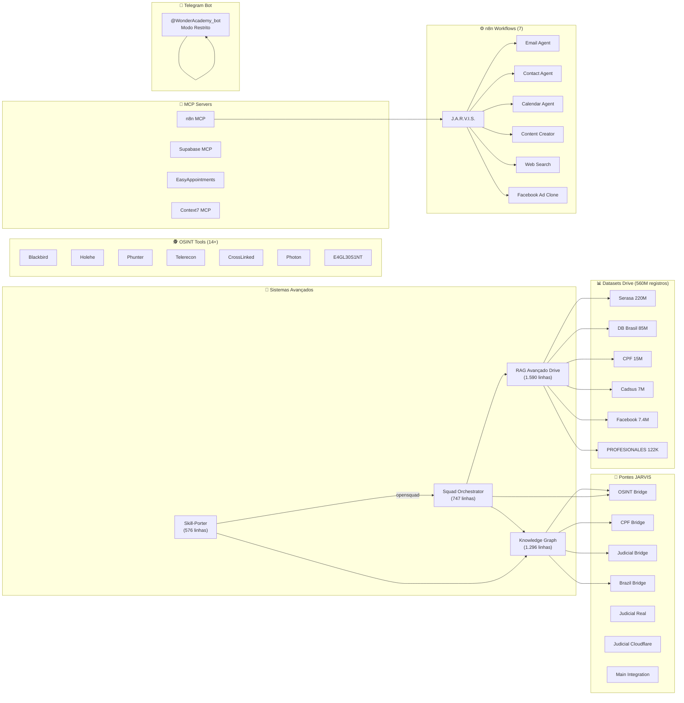

# 🏗️ Arquitetura Completa do Ecossistema Agent Zero

> Documento gerado em 2026-04-29

## Visão Geral



## 📊 Tabela de Componentes

### 4 Sistemas Avançados

| Sistema | Linhas | Arquivos | Função |
|---------|--------|----------|--------|
| Knowledge Graph | 1.296 | 3 | SPO + Query Engine + 5 bridges |
| Skill-Porter | 576 | 1 | Absorção de repositórios (cópia/clone → análise → bridge → skill → catálogo) |
| Squad Orchestrator | 747 | 1 | 3 squads (OSINT, Conteúdo, Jurídico), 11 agentes, 1 pipeline |
| RAG Avançado Drive | 1.590 | 3 | FAISS + Drive connector + Query Enhancer (KG) + Auto Index + Intelligence Search |
| **Total** | **4.209** | **8** | |

### Bridges JARVIS (7)

| Bridge | Arquivo | Função |
|--------|---------|--------|
| OSINT Bridge | `osint_bridge.py` | Consultas OSINT integradas |
| CPF Bridge | `cpf_bridge.py` | Consulta de CPFs |
| Judicial Bridge | `judicial_bridge.py` | Dados processuais |
| Brazil Bridge | `brazil_bridge_final.py` | Receita Federal, CNPJ (12GB SQLite) |
| Judicial Real | `judicial_bridge_real.py` | Consulta judicial real |
| Judicial Cloudflare | `judicial_bridge_cloudflare.py` | Consulta via Cloudflare |
| Main Integration | `main_integration.py` | Orquestrador principal |

### Datasets no Google Drive (6 configurados, 334M registros)

| Dataset | ID | Registros | Tipo | Campos |
|---------|----|-----------|------|--------|
| Serasa | `1Lp3uCFNpBaoFmILm-RJLfJAKHd_8we3T` | 220.000.000 | CSV (pipe) | cpf, nome, sexo, nascimento |
| DB Brasil | `1M_lrPmcfmJ7KVwDxV4_QvfGrvIG-Vs4P` | 85.000.000 | SQLite | 13 campos (cpf, nome, sexo, nascimento, mae, pai, email, celular, rua, bairro, cidade, estado, cep) |
| CPF 15M | `1N5k_gB7j90J6jhCjNjaWOylyEnd5sW6E` | 15.000.000 | SQLite | 12 campos |
| Cadsus SUS | `1CCMN37G_xPuMy2sZ0CNKK9o5z1GPZsA1` | 7.000.000 | SQLite | 12 campos |
| Facebook DB | `—` | 7.400.000 | SQLite | 7 campos |
| PROFESIONALES | `1xWdOqEJI7VuFWCZ0tYjagP3yz0ML9zZq` | 122.500 | CSV (tab) | 8 campos (nome, cidade, estado, ddd, telefone, sexo, email, profissao) |

### OSINT Tools (14+)

| Ferramenta | Linguagem | Função |
|------------|-----------|--------|
| Blackbird | Python | Busca em redes sociais por username |
| Holehe | Python | Verifica emails em serviços online |
| Phunter | Python | Busca por telefone/pessoa |
| Telerecon | Python | Análise de grupos/canais Telegram |
| CrossLinked | Python | Scraping LinkedIn |
| Photon | Python | Crawler de páginas web |
| E4GL30S1NT | Python | OSINT automatizado (100+ módulos) |

### MCP Servers (4)

| Servidor | URL | Autenticação | Função |
|----------|-----|--------------|--------|
| n8n | `https://n8n.techstorebrasil.com/mcp-server/http` | Bearer JWT + API Key | Workflow automation (7 workflows) |
| Supabase | Local: `mcp_servers/supabase_mcp.py` | Supabase | Database + auth |
| Easy!Appointments | `https://cal.techstorebrasil.com/index.php/api/v1` | Token | Scheduling (serviço de 30min) |
| Context7 | `https://context7.com/api/v2` | API Key | Code documentation (5 Next.js libs) |

### Token Optimization (plugin `_token_optimizer`)

| Fase | Módulo | Redução |
|------|--------|---------|
| 1-2 | Semantic Cache (FAISS + tiktoken) | ~29% hit rate |
| 3 | Context Compression (ACON-style) | 24-82% |
| 4 | Dynamic Prompts (lazy loading) | 40-60% |
| 5 | Prompt Distiller (tiktoken) | 36-60% |
| **Total estimado** | | **50-70%** |

### 🚀 Repositórios Importados (Skill-Porter)

| Repositório | Arquivos | Linhas | Estrelas | Bridge |
|-------------|----------|--------|----------|--------|
| `knowledge_graph_v2` | 8 | ~500 | — | 50 linhas |
| `opensquad` | 381 | 68.044 | 1.544 ★ | 67 linhas |

## 📋 Arquitetura de Dados

### Fluxo de Busca Inteligente
```
Usuário → IntelligenceSearch.search(query)
            ├── Detecta tipo (pessoa/empresa/contato/judicial/osint/endereco)
            ├── Extrai entidades (CPF, email, tel, CNPJ, nome)
            ├── Knowledge Graph → SPO Engine → triplas relacionadas
            ├── RAG Engine → FAISS index → busca semântica
            ├── Squad Orchestrator → suggest_squad(query)
            └── Sumário consolidado ← resultado
```

### Fluxo de Indexação Automática
```
Drive Dataset → AutoIndexPipeline
                  ├── DriveConnector (6 datasets configurados)
                  ├── _extract_sample() → byte-range HTTP
                  ├── EmbeddingEngine (all-MiniLM-L6-v2)
                  ├── VectorIndex (FAISS Flat/IVF)
                  └── Índice salvo (.faiss + .json)
```

### Stack de Tecnologias
- **Linguagem**: Python 3.11
- **IA**: deepseek/deepseek-chat (LLM principal)
- **Vetores**: FAISS 1.13.2, sentence-transformers (all-MiniLM-L6-v2)
- **Grafo**: SPO Engine custom (JSONL persistence, TUID, DFS query)
- **Databases**: SQLite (12GB+), CSV (pipe/tab), XLSX
- **Automation**: n8n (Docker/Local), MCP servers
- **Comunicação**: Telegram Bot API, FastA2A (multi-agent)
- **Sistema**: Kali Linux Docker container

## 📊 Estatísticas do Sistema

| Métrica | Valor |
|---------|-------|
| Total de linhas de código (sistemas avançados) | ~4.209 |
| Total de arquivos projetados | 80+ |
| Total de sistemas/sub-sistemas | 50+ |
| Total de repositórios importados | 2 |
| Total de bridges JARVIS | 7 |
| Total de n8n workflows | 7 |
| Total de MCP servers | 4 |
| Total de ferramentas OSINT | 14+ |
| Total de datasets configurados | 6 (334M registros) |
| Total de squads (Squad Orchestrator) | 3 (11 agentes) |
| Total de triplas SPO (Knowledge Graph) | 64 |
| Redução de tokens estimada | 50-70% |
